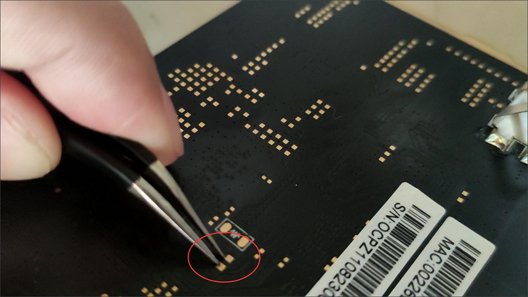
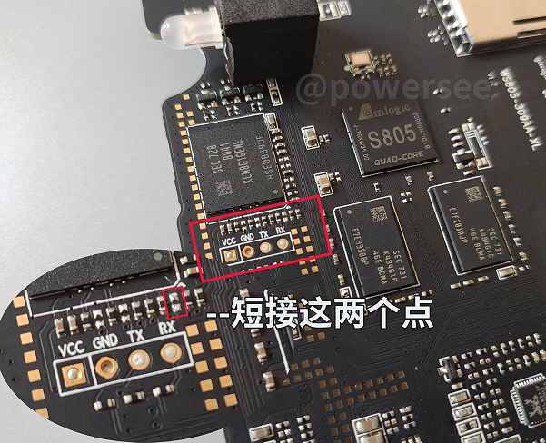

我手里有个赚钱宝3的机器，其实也就是玩客云的硬件，被网心云官方刷过系统的。现在这玩意沦为矿渣，刷成 Armbian 系统废物利用一下。

## 1. 软硬件工具准备

主要软件工具和刷机固件来自：
> https://www.aliyundrive.com/s/ZM3oScBDcck
> 
>「提取码: y75j」

包含：
- `update.img`：安卓底包，用于支持U盘启动。
- `USB Burning Tool`：晶晨（Amlogic）刷机软件。
- `Etcher`：将系统固件写入U盘的软件。
- `armbian5.88`：5.88 版本的系统固件。
- `WKY-Armbian_20.12_5.9.0.img`：5.9 版本的系统固件。
- `putty`：ssh 工具，用 Windows 10 自带的也行。

其他工具：

- U盘：用来写入 Armbian 系统固件。
- USB 双公线：主板连接电脑用，网购九块九包邮。
- 撬片：拆机用，可以用刀片啥的替代。
- 吹风机：加热方便拆机。
- 镊子：短接主板用，可以用其他金属物件替代。
- 米家智能插座（可选）：方便给主板通/断电，省得多次插拔电源。

## 2. 拆机

用吹风机加热接口侧的塑料面板，然后翘起一角撕开。因为是双面胶粘的，没有卡扣，算比较好拆的。拧起六个螺丝，就可以把主板抽出来了。

## 3. 刷底包

1. USB 公对公线，一头接电脑，一头接主板 **靠近HDMI** 的USB口。
2. 打开 `USB Burning Tool`，加载 `update.img`，勾选“擦除flash”和“擦除bootloader”，点击开始。
3. 使用镊子短接主板，然后通电，正常情况下会听到听到电脑上 USB 接口插入的提示音，然后软件会开始刷机。

   短接的位置新旧版主板会有不同，引用下 [@powersee](https://powersee.github.io/2021/01/wankeyun-server/) 的图：
   老版本的在背面：
   
   我的是 V1.3 版的在正面：
   
4. 等到软件提示烧录成功，点击“停止”，然后关闭软件，拔出 USB 线。

这个步骤是最容易失败的，如果一直失败，可以换个USB口试试，USB 3.0、2.0 的都试试。
如果提示“解析烧录固件失败”，可能是电脑的语言不对，我把 Windows 语言改成中文，区域设置改成中文，之后就好了。

## 4. 刷系统包

1. 使用 `Etcher` 软件将 `armbian5.88` 写入 U 盘，注意不要选错设备写到硬盘或别的盘里了。
2. 将写好固件的U盘插入主板 **靠近网口** 的USB口。
3. 给主板通电，等待一段时间，会自动开始刷机，指示灯会蓝紫闪烁，最终蓝色常亮证明完成，断电，拔出U盘。
4. 使用 `Etcher` 软件将 `WKY-Armbian_20.12_5.9.0.img` 写入 U 盘，重复 2、3步的动作，等待完成。
5. 用网线把主板和路由器相连，再登录到路由器的后台，寻找路由器给主板分配的 IP 地址，设备名应该是 `aml-s812`，记录下 IP 地址。
6. 使用 putty 或者 xshell 这样的 SSH 工具连接主板，Windows 10 自带的 ssh 也可以，用户名 `root`，密码 `1234`。首次登录会有一些初始化设置。
7. 此时系统还在U盘上，需要正式安装到EMMC：

    ```shell
    cd /boot/install
    ./install.sh
    ```
   等待一段时间后，刷机就算正式完成了。

我也不清楚为啥不直接刷 `5.9.0` 的而是先刷了 `5.88` 的，反正照着操作成功了。

## 5. 软件源与 Docker

使用 vim 编辑 `/etc/apt/sources.list`，换成国内的源。

Docker 按照 debain 系统的说明，用官方软件包安装就行：https://docs.docker.com/engine/install/debian/

## 6. 参考资料

- 玩客云刷机armbian变身openwrt旁路由教程＆性能测试：<https://www.yitoujing.com/article/11>
- B站视频：玩客云矿渣变身armbian+openwrt旁路由: <https://www.bilibili.com/video/BV1Jg411Y77e>
- 玩客云刷机刷入Armbian系统教程：<https://cloud.tencent.com/developer/article/2160265>
- 玩客云刷机-玩机教程： <https://isedu.top/index.php/archives/141/>
- 玩客云乱七八糟的坑： <https://docs.qq.com/doc/DWkhNSmRuQld0UEd0>